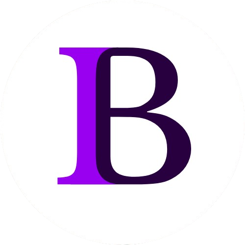

  

<h1 align="center">Portfólio pessoal</h1>

<b>Portfólio pessoal simples que apresenta informações sobre mim e meus projetos desenvolvidos.</b> 

  
  

## Funcionalidades

* Exibir informações sobre mim e meus projetos;
* Exibir um modal com mais informações sobre cada projeto ao clicar em um botão;
* Filtrar projetos exibidos de acordo com categorias;
* Executar animação de slide simples ao rolar sobre as seções;
* Alternar entre tema escuro e claro;
* Armazenar preferência de tema no local storage do navegador;
* Aplicar preferência de tema armazenada automaticamente ao carregar a página;
* Responsividade em dispositivos com diferentes tamanhos de tela.
  

https://github.com/user-attachments/assets/ef199ba1-6741-4c17-aaeb-3c955bac904b

## Tecnologias 
* HTML5
* CSS3
* JavaScript
* Bootstrap
* Figma
* Canva

## Acesso ao projeto

Você pode acessar o projeto <a href="https://isabelaborgs.github.io/portfolio/" target="_blank">neste link</a>.

Desenvolvido por Isabela Borges

